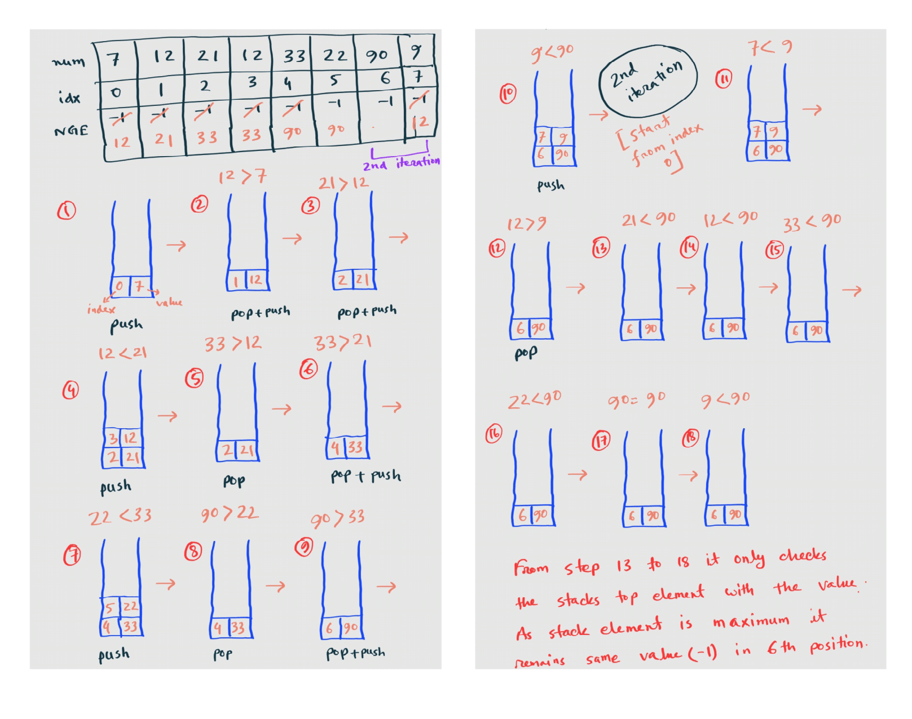

### ©️ [Kamrul Islam Shahin](https://www.linkedin.com/in/mdkamrulshahin/)

<h2><a href="https://leetcode.com/problems/next-greater-element-ii/">503. Next Greater Element II</a></h2><h3>Medium</h3><hr><i>Tags:</i></br>
<b>stack</b>
</br>
<i>Companies:</i></br>
<b>google</b><hr>
<div><p>Given a circular integer array <code>nums</code> (i.e., the next element of <code>nums[nums.length - 1]</code> is <code>nums[0]</code>), return <em>the <strong>next greater number</strong> for every element in</em> <code>nums</code>.</p>

<p>The <strong>next greater number</strong> of a number <code>x</code> is the first greater number to its traversing-order next in the array, which means you could search circularly to find its next greater number. If it doesn't exist, return <code>-1</code> for this number.</p>

<p><strong>Example 1:</strong></p>

<pre><strong>Input:</strong> nums = [1,2,1]
<strong>Output:</strong> [2,-1,2]
Explanation: The first 1's next greater number is 2; 
The number 2 can't find next greater number. 
The second 1's next greater number needs to search circularly, which is also 2.
</pre>

<p><strong>Example 2:</strong></p>

<pre><strong>Input:</strong> nums = [1,2,3,4,3]
<strong>Output:</strong> [2,3,4,-1,4]
</pre>

<p><strong>Constraints:</strong></p>

<ul>
	<li><code>1 <= nums.length <= 10<sup>4</sup></code></li>
	<li><code>-10<sup>9</sup> <= nums[i] <= 10<sup>9</sup></code></li>
</ul>
</div>
</br>

---

## **Algorithm: (Monotonic Stack)**

- Initially we need to take a list of elements `NGE` having all -1 as a next greater element.
- Then we are iterating through the nums list, and pushing each elements position onto a stack of unassigned elements.
- If stack is empty or the current element is less than or equal to the top of the stack, push the current elements position onto the stack.
- If the current element is greater than the value of top of the stack, then pop it off and assign the element to the `NGE[top]`. This process will continue if the stack is not empty and the current element is greater than the value of top of the stack.
- After iterating through the list once, we are left with circular and unassignable values on the stack. We only need to iterate through one more time, because then we will have gone a full circle and remaining stack values can be assigned.

#### Explanation:

- **Stack for next greater element:** Suppose we have a decreasing sequence followed by a greater number. For example [5, 4, 3, 2, 1, 6] then the greater number 6 is the next greater element for all previous numbers in the sequence.
- **Handling duplicates in input:** Push the index on the stack instead the value. This makes sure duplicated elements are correctly handled. Example:[7, 4, 3, 4, 1, 3, 6] - we need to have the right answer for both 3s.
- **Handling circular array:** Process it twice. Example: [5,4,3,2,1]. By processing it twice, you are essentially doing: [5,4,3,2,1]+[5,4,3,2,1]. Typical pattern to solve circular array problems is to extend the original array to twice length, 2nd half has the same element as first half.

### Complexity:

Time complexity: O(n)</br>
Space complexity: O(n)

## Solution:

### Approach #1

```py
class Solution:
    def nextGreaterElements(self, nums: List[int]) -> List[int]:
        # storing the nums position in the stack instead of value
        stack = []
        nge = [-1] * len(nums)
        for idx, num in enumerate(nums):
            while stack and nums[stack[-1]] < num:
                popVal = stack.pop()
                nge[popVal] = num
            stack.append(idx)

        # 2nd iteration is for remaining element in the stack
        for idx, num in enumerate(nums):
            while stack and nums[stack[-1]] < num:
                popVal = stack.pop()
                nge[popVal] = num

        return nge
```

### Implementation:



### Approach #2

Here, we iterate from [2n-1...0] instead of from [n-1..0], and to access value if nums[i] we access nums[i % n].

```py
class Solution:
    def nextGreaterElements(self, nums: List[int]) -> List[int]:
        st = []
        n = len(nums)
        ans = [-1] * n
        for i in range(2*n-1, -1, -1):
            while st and st[-1] <= nums[i%n]:
                st.pop()
            if st and i < n:
                ans[i] = st[-1]
            st.append(nums[i%n])
        return ans
```

### Approach #3

```py
class Solution:
    def nextGreaterElements(self, nums: List[int]) -> List[int]:
        nums2 = nums + nums
        records = []
        next_greater = [-1] * len(nums2)
        for i in range(len(nums2) - 1, -1, -1):
            num = nums2[i]
            while records and records[-1] <= num:
                records.pop()
            if records:
                next_greater[i] = records[-1]
            records.append(num)

        return next_greater[:len(nums)]

```

### Approach #4

Use the stack to record the reversed array nums. Loop the array from last integer to the first one. If the last integer in stack is bigger than the current interger in array, we have found the answer. Otherwise, we need to keep pop up the integer in stack. Besides, we need to push the current integer to the stack in each step.

```py
class Solution(object):
    def nextGreaterElements(self, nums):
        n = len(nums)
        ret = [-1] * n
        stack = nums[::-1]
        for i in range(n - 1, -1, -1):
            while stack and stack[-1] <= nums[i]:
                stack.pop()
            if stack:
                ret[i] = stack[-1]
            stack.append(nums[i])
        return ret

```

### Approach #5

```py
class Solution:
    def nextGreaterElements(self, nums: List[int]) -> List[int]:
        s = []

        size = len(nums)
        res = [-1 for i in range(size)]

        for i in range(2 * size):
            i = i % size
            while len(s) != 0 and nums[s[-1]] < nums[i]:
                item = s.pop()
                res[item] = nums[i]
            s.append(i)

        return res
```

### Approach #6

```py
class Solution(object):
    def nextGreaterElements(self, nums):
        n = len(nums)
        ret = [-1] * n
        stack1 = []
        stack2 = nums[::-1]
        for i in range(n - 1, -1, -1):
            while stack1 and stack1[-1] <= nums[i]:
                stack1.pop()
            if stack1:
                ret[i] = stack1[-1]
            else:
                while stack2 and stack2[-1] <= nums[i]:
                    stack2.pop()
                if stack2:
                    ret[i] = stack2[-1]
            stack1.append(nums[i])
        return ret
```

### Approach #7

```py
class Solution:
    def nextGreaterElements(self, nums: List[int]) -> List[int]:
        stack = []
        res = [-1] * len(nums)
        for _ in range(2):
            for i, e in enumerate(nums):
                while stack and e > nums[stack[-1]]:
                    res[stack.pop()] = e
                stack.append(i)
        return res
```

### Approach #8 (Brute Force)

Time complexity: O(n^2)</br>
Space complexity: O(n)

```py
class Solution:
    def nextGreaterElements(self, nums):
        res = []
        for i in range(len(nums)):
            for j in range(len(nums)):
                index = (i+j) % len(nums)
                if nums[index] > nums[i]:
                    res.append(nums[index])
                    break
            if len(res) <= i:
                res.append(-1)
        return res
```

## Practice:

[Leetcode monotonic stack problems](https://leetcode.com/tag/monotonic-stack/)
