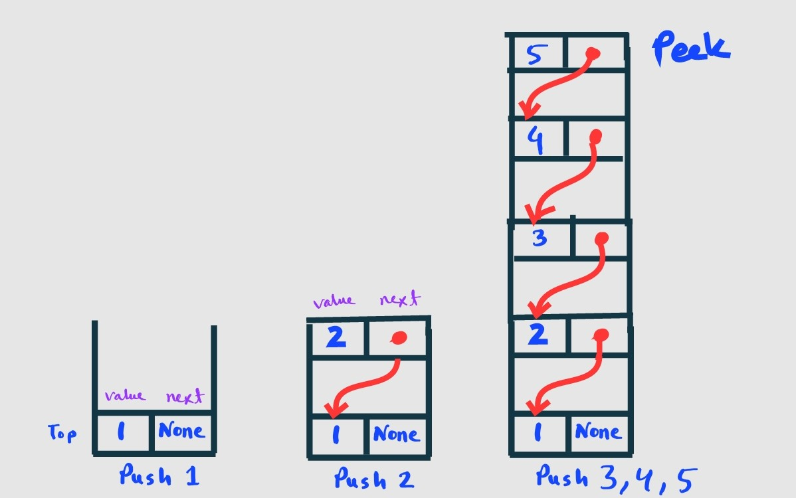

### Author: [Kamrul Islam Shahin 🇧🇩](https://www.linkedin.com/in/mdkamrulshahin/)

# 🚀️ Stack Data Structure (15 days study plan)

- Linear data structure
- Follows the principle of **Last In First Out (LIFO)**
- Last element inserted inside the stack is removed first.


## 🚀️ Stack operations:

- **push**: Pushes an item at the top of the stack.
- **pop**: Remove and return the item from the top of the stack.
- **peek**: Returns the item at the top of the stack without removing it.
- **size**: Returns the total number of items in the stack.
- **isEmpty**: Checks whether the stack is empty.
- **isFull**: Checks whether the stack is full.

## 🚀️ Implementing Stack using Arrays

### \* Method 1

```python
stack = []

# append() function to push
# element in the stack
stack.append('a')
stack.append('b')
print('Initial stack:')
print(stack)

# pop() fucntion to pop element from stack in LIFO order
print('Elements poped from stack:')
print(stack.pop())
print(stack.pop())
print('Stack after elements are poped:')
print(stack)
print(stack.pop())
```

Output:

```
Initial stack:
['a', 'b']
Elements poped from stack:
b
a
Stack after elements are poped:
[]
---------------------------------------------------------------------------
IndexError                                Traceback (most recent call last)
/tmp/ipykernel_146307/3602183844.py in <module>
     16 print('Stack after elements are poped:')
     17 print(stack)
---> 18 print(stack.pop())

IndexError: pop from empty list
```

#### Drawbacks

- It can run into speed issues as it grows.
- The last command will raise an IndexError after calling .pop() on an empty stack.

### \* Method 2

```python
class Stack:
    def __init__(self):
        self.stack = []

    # Use list append method to push element
    def push(self, val):
        self.stack.append(val)
        return val

    # Stack is empty when stack size is 0
    def isEmpty(self):
        return len(self.stack) == 0

    # Use list pop method to remove element
    def pop(self):
        if self.isEmpty():
            return ("No element in the Stack")
        else:
            return self.stack.pop()

    # Use peek to look at the top of the stack
    def peek(self):
        if self.isEmpty():
            return ("No element in the Stack")
        else:
            return self.stack[-1]

    def print(self):
        return self.stack


stack = Stack()
print("push:", stack.push(1))
print("push:", stack.push(2))
print(stack.print())
print("pop:", stack.pop())
print("pop:", stack.pop())
print("pop:", stack.pop())
print(stack.print())
print("peek:", stack.peek())
print("push:", stack.push(3))
print("push:", stack.push(4))
print(stack.print())
print("peek:", stack.peek())
```

Output:

```
push: 1
push: 2
[1, 2]
pop: 2
pop: 1
pop: No element in the Stack
[]
peek: No element in the Stack
push: 3
push: 4
[3, 4]
peek: 4
```

### \* Method 3 (Implementing all operations)

```python
class Stack:
    def __init__(self, size):
        self.stack = [None] * size
        self.size = size
        self.top = -1

    # Use list append method to push element
    def push(self, val):
        if self.isFull():
            return ("Stack overflow")
        else:
            self.top += 1
            self.stack[self.top] = val
            return val

    # Stack is full when self.size is equal to top + 1
    def isFull(self):
        return self.size == self.top + 1

    # Stack is empty when top is -1
    def isEmpty(self):
        return self.top == -1
        # OR return self.size() == 0

    # Use list pop method to remove element and set as None
    def pop(self):
        if self.isEmpty():
            return ("Stack underflow")
        else:
            topVal = self.stack[self.top]
            self.stack[self.top] = None
            self.top -= 1
            return topVal

    # Use peek to look at the top of the stack
    def peek(self):
        if self.isEmpty():
            return ("Stack empty")
        else:
            return self.stack[self.top]

    # Stack size
    def size(self):
        return self.top + 1

    def print(self):
        return self.stack


stack = Stack(3)
print("push:", stack.push(1))
print("push:", stack.push(2))
print(stack.print())
print("pop:", stack.pop())
print("pop:", stack.pop())
print(stack.print())
print("pop:", stack.pop())
print("peek:", stack.peek())
print("push:", stack.push(3))
print("push:", stack.push(4))
print("push:", stack.push(5))
print("push:", stack.push(6))
print(stack.print())
print("peek:", stack.peek())
```

Output:

```
push: 1
push: 2
[1, 2, None]
pop: 2
pop: 1
[None, None, None]
pop: Stack underflow
peek: Stack empty
push: 3
push: 4
push: 5
push: Stack overflow
[3, 4, 5]
peek: 5
```

## 🚀️ Implementing Stack using deque

```python
from collections import deque
stack = deque()

# append() function to push element in the stack
stack.append(1)
stack.append(2)
stack.append(3)
print(stack)
# pop() fucntion to pop element from stack in LIFO order
print("pop:", stack.pop())
# appendleft() function to push element in the left side of the stack
stack.appendleft(11)
print(stack)
stack.append(12)
print(stack)
print("popleft:", stack.popleft())
print(stack)
print("peek:", stack[-1])
print("pop:", stack.pop())
print(stack)
print("popleft:", stack.popleft())
print(stack)
```

Output:

```
deque([1, 2, 3])
pop: 3
deque([11, 1, 2])
deque([11, 1, 2, 12])
popleft: 11
deque([1, 2, 12])
peek: 12
pop: 12
deque([1, 2])
popleft: 1
deque([2])
```

## 🚀️ Implementing Stack using LifoQueue

```python
from queue import LifoQueue

stack = LifoQueue(maxsize=3)
# qsize() show the number of elements in the stack
print("Size:",stack.qsize())
# put() function to push element in the stack
stack.put(1)
print("Full:", stack.full())
stack.put(2)
stack.put(3)
print("Full:", stack.full())
print("Size:", stack.qsize())
# get() fucntion to pop element from stack in LIFO order
print("pop:",stack.get())
print("pop:",stack.get())
print("pop:",stack.get())
print("Empty:", stack.empty())
```

Output:

```
Size: 0
Full: False
Full: True
Size: 3
pop: 3
pop: 2
pop: 1
Empty: True
```

#### Notes

- Both deque and LifoQueue implementation gives an error while popping element and finding the peek element from the stack if the stack is empty.

## 🚀️ Implementing Stack using LinkedList



```py
# node class
class StackNode:
    def __init__(self, value):
        self.value = value
        self.next = None


class Stack:
    def __init__(self):
        self.head = None
        self.size = 0

    # String representation of the stack
    def __str__(self):
        cur = self.head
        out = ""
        while cur:
            out += str(cur.value) + "->"
            cur = cur.next
        out += "None"
        return out

    # Get the current size of the stack
    def getSize(self):
        return self.size

    # Check if the stack is empty
    def isEmpty(self):
        return self.size == 0

    # Get the top item of the stack
    def peek(self):
        if self.head is None:
            return "Empty stack"
        else:
            return self.head.value

    # Push a value into the stack.
    def push(self, value):
        if self.head is None:
            self.head = StackNode(value)
            self.size += 1
        else:
            node = StackNode(value)
            node.next = self.head
            self.head = node
            self.size += 1

    # Remove a value from the stack and return.
    def pop(self):
        if self.head:
            remove = self.head
            self.head = self.head.next
            self.size -= 1
            return remove.value
        else:
            return "Empty stack"


# Driver Code
if __name__ == "__main__":
    stack = Stack()
    for i in range(1, 5):
        stack.push(i)
        print(f"Push: {i} | {stack}")
    print("Peek:", stack.peek())
    for _ in range(1, 6):
        remove = stack.pop()
        print(f"Pop: {remove} | {stack}")
    print("Peek:", stack.peek())

```

Output:

```
Push: 1 | 1->None
Push: 2 | 2->1->None
Push: 3 | 3->2->1->None
Push: 4 | 4->3->2->1->None
Peek: 4
Pop: 4 | 3->2->1->None
Pop: 3 | 2->1->None
Pop: 2 | 1->None
Pop: 1 | None
Pop: Empty stack | None
Peek: Empty stack
```

## 🚀️ Solve problems

1. [Problems from InterviewBit](https://www.interviewbit.com/courses/programming/topics/stacks-and-queues)
2. [Problems from leetcode](https://leetcode.com/tag/stack)
3. [Problems from hackerrank](https://www.hackerrank.com/domains/data-structures?filters%5Bsubdomains%5D%5B%5D=stacks)
4. [Problems from hackerrank (Interview)](https://www.hackerrank.com/interview/interview-preparation-kit/stacks-queues/challenges)

## 🚀️ Referances

1. [Geeksforgeeks](https://www.geeksforgeeks.org/stack-data-structure-introduction-program/)
2. [Techiedelight](https://www.techiedelight.com/stack-implementation-python/)
3. [Programiz](https://www.programiz.com/dsa/stack)
4. [RealPython](https://realpython.com/how-to-implement-python-stack/)
5. [GFG](https://www.geeksforgeeks.org/python-queue-lifoqueue-vs-collections-deque/https:/)
